# Детальная раскадровка 3D истории Восхождение

IM Potent — путь от «I can’t» к «I’m potent». Документ описывает 8 сцен и 32 ключевых кадра по предоставленному файлу `message (1).txt`. Сцены реализованы в лендинге; изображения получены из его Three.js-моделей, а не являются независимыми концептами.

## Как читать раскадровку

У каждой сцены четыре кадра: A — вход, B — развитие, C — главное действие, D — завершение. Показатели 0%, 33%, 66%, 100% относятся к локальному развитию главы. На лендинге скорость зависит от прокрутки: 72% интервала удерживают композицию и развивают действие, 28% переводят камеру к следующему этапу. В отдельном просмотре можно выбирать кадр и запускать короткое воспроизведение.

Человеческие фигуры состоят из отдельной головы, корпуса, рук, бёдер, коленей и ступней. Low-poly означает упрощённую геометрию, а не безликие одиночные капсулы.

## Общий маршрут

| Сцена | Раздел | Смысл | Камера |
|---|---|---|---|
| 0 | Hero | Дно | Ракурс снизу |
| 1 | Проблема | Лабиринт правил | Средний или общий план |
| 2 | Подход | Встреча с тренером | Средний или общий план |
| 3 | Программы | Развилка троп | Высокий ракурс карты |
| 4 | Прогресс | Подъём | Сопровождение ученика |
| 5 | О репетиторе | Обзор пути | Общий план всей спирали |
| 6 | Тарифы | Уровни | Средний или общий план |
| 7 | Контакты | Вершина | Ракурс снизу |

## Сцена 0 Дно

Раздел: Hero.

Знания накопились, но человек застрял. Начало истории показывает состояние ученика до практики.

**Композиция и камера.** Низкий ракурс со стороны ученика. В кадре одновременно читаются голова, руки, экран ERROR и вертикальные стопки книг. Горизонт ниже плеч; объекты сверху создают ощущение давления.

**Окружение.** Бетонное основание; стол, клавиатура и монитор; стул; гора учебников на столе; четыре стены-тупика из книг; разбросанные книги на полу.

**Ученик.** Сидит, корпус наклонён вперёд, голова опущена. Колени согнуты, кисти направлены к клавиатуре. Серый #6B6B6B. Сам ученик неподвижен во всех четырёх кадрах.

**Тренер.** Не появляется. Отсутствие тренера подчёркивает одиночество.

**Свет и атмосфера.** Холодный голубой источник сверху; красный экран как локальный акцент. Длинные тени. Тёмный фон #0A0A0F, плотный FogExp2. Редкие серые пылинки падают.

### Кадр 00A Человек на дне

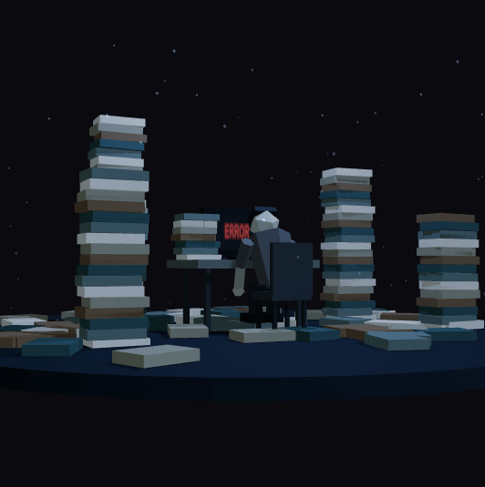

Развитие сцены: 0%.

Общий низкий план. Ученик окружён книгами; силуэт сгорблен. Ни одной уверенной позы или яркого лаймового акцента.

Установить масштаб: книги выше головы. ERROR уже читается, но остаётся вторым центром внимания.

### Кадр 00B Ошибка вместо голоса

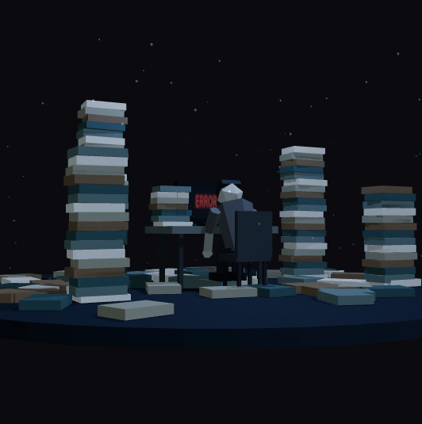

Развитие сцены: 33%.

Экран мягко мерцает. Ученик сохраняет ту же позу. В свете видны несколько медленно падающих пылинок.

Мерцание меняет прозрачность текста, а не геометрию монитора; без резкой вспышки на весь кадр.

### Кадр 00C Вес накопленных правил

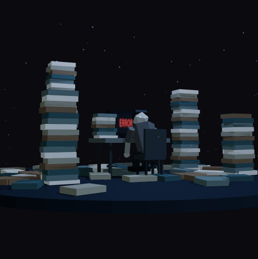

Развитие сцены: 66%.

Высокие стопки слегка покачиваются, создавая ощущение неустойчивости. Разбросанные книги удерживают взгляд внизу.

Амплитуда покачивания около одного градуса. Поза человека остаётся полностью неподвижной.

### Кадр 00D Начало выхода

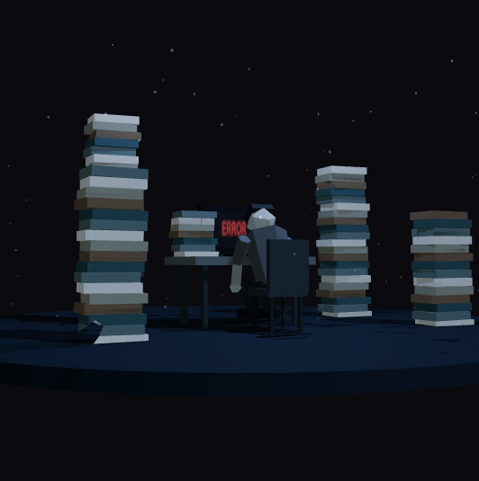

Развитие сцены: 100%.

Напольные книги исчезают, освобождая пространство. В конце интервала камера поднимается к лабиринту.

Стопки не превращаются в декоративную лестницу: они остаются узнаваемыми учебниками.

**Переход.** Книги на полу теряют непрозрачность. Камера начинает подниматься и раскрывает стены следующей сцены. Туман сохраняет холодный тон.

## Сцена 1 Лабиринт правил

Раздел: Проблема.

Количество правил и пройденных курсов не превращается в практику разговора.

**Композиция и камера.** Средний план сверху и сбоку. Высота позволяет увидеть коридоры и движение между ними, но сохраняет читаемый человеческий силуэт.

**Окружение.** Стены из стопок книг разной высоты. Надписи PRESENT PERFECT, PASSIVE VOICE, CONDITIONAL III. Парящие таблички «5 лет школы», «3 курса», «2 приложения», «0 практики». Линии трещин на стенах.

**Ученик.** Идёт по замкнутому маршруту, меняет направление, разводит руки. Спина чуть согнута, голова наклонена. Серый цвет сохраняется.

**Тренер.** Ещё не виден.

**Свет и атмосфера.** Холодный серо-синий. Тёплых источников нет. Плотная дымка скрывает дальние стены. Пылинки редкие и серые.

### Кадр 01A Вход в лабиринт

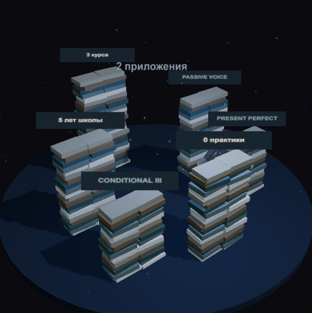

Развитие сцены: 0%.

Стены стоят целыми. Ученику виден лишь ближайший проход. Таблички объясняют накопленный опыт без практики.

Ширина прохода больше плеч ученика, поэтому движение выглядит возможным, а не как пересечение стен.

### Кадр 01B Повторение одного маршрута

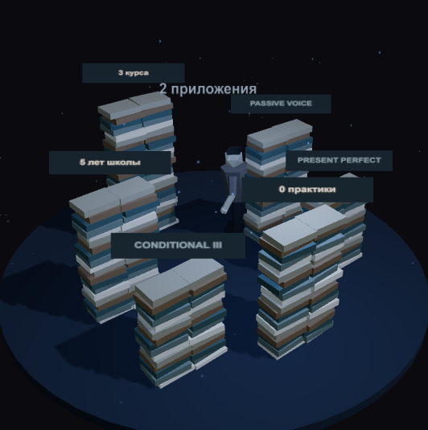

Развитие сцены: 33%.

Ученик петляет по кривой, возвращаясь к тому же месту. Руки разведены; таблички медленно покачиваются.

Шаги собираются из движения бёдер, коленей и корпуса. Голова и торс остаются отдельными частями модели.

### Кадр 01C Правила теряют власть

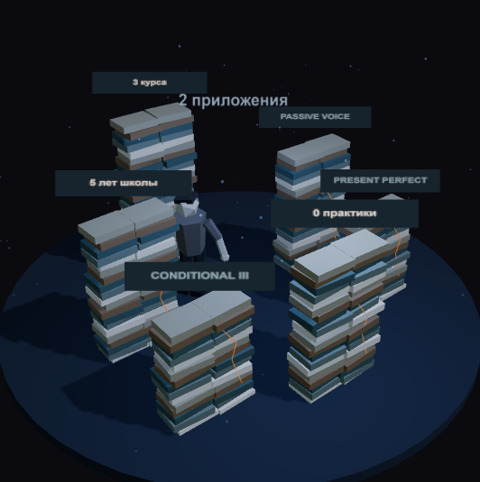

Развитие сцены: 66%.

На наружных поверхностях появляются оранжевые линии трещин. Стены слегка сжимаются и разжимаются.

Трещины — дополнительная геометрия поверх книг. На этом этапе сама стена ещё читается целой.

### Кадр 01D Стены рассыпаются

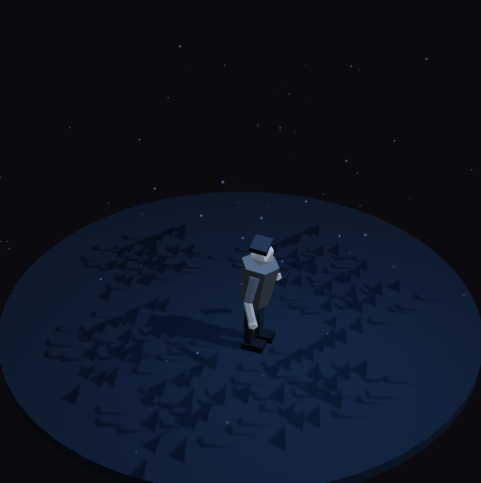

Развитие сцены: 100%.

Книги опускаются к полу и расходятся в стороны, надписи исчезают вместе со стенами. Ученик получает свободный выход.

Распад обратим при прокрутке назад. Не создаём новые объекты каждый кадр: меняем матрицы InstancedMesh.

**Переход.** Сначала появляются трещины, затем стены распадаются на отдельные книги. Книги падают, исчезают; открывается пространство для встречи.

## Сцена 2 Встреча с тренером

Раздел: Подход.

Появляется человек, который помогает превратить разрозненные знания в маршрут действий.

**Композиция и камера.** Боковой ракурс с небольшим подъёмом. Ученик и тренер стоят друг напротив друга, между ними видна светящаяся связь. Четыре зоны читаются на втором плане.

**Окружение.** Открытая площадка. Диагностика — стол, карта и лупа; план — доска с маршрутом; практика — микрофон и наушники; результат — подиум с флагом.

**Ученик.** Стоит неуверенно. Плечи и голова постепенно поднимаются, корпус выпрямляется. Цвет переходит от серого к серо-лаймовому.

**Тренер.** Янтарный силуэт #F5C77E. Устойчивая вертикальная поза; протягивает руку. Указка помогает различить роль тренера.

**Свет и атмосфера.** Первый тёплый источник #F5C77E. Туман заметно слабее. Золотистые искры поднимаются, их скорость выше скорости пыли.

### Кадр 02A Первая встреча

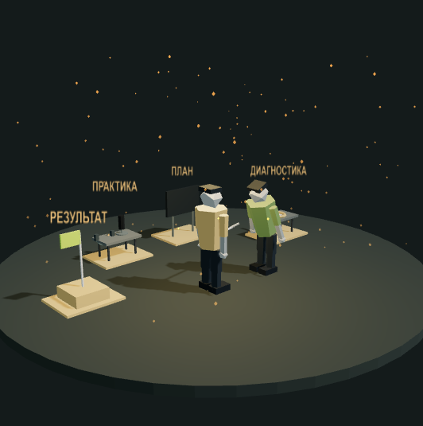

Развитие сцены: 0%.

Оба силуэта стоят в открытом пространстве. Ученик ещё наклонён, тренер уже выпрямлен. Четыре зоны видны, но не все подсвечены.

В центре остаётся воздух: ничего не перекрывает головы и жест руки.

### Кадр 02B Диагностика и план

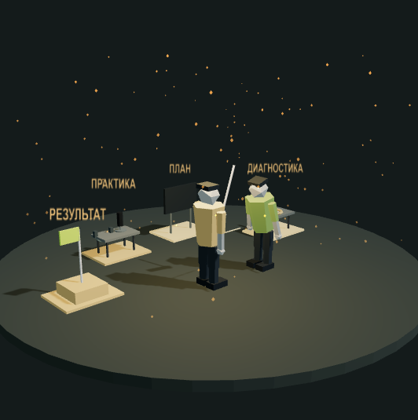

Развитие сцены: 33%.

Тренер протягивает руку. Линия связи растёт к ученику. Подсвечиваются лупа и доска с маршрутом.

Начало линии привязано к фигуре тренера; рост идёт в направлении ученика.

### Кадр 02C Практика вместо ожидания

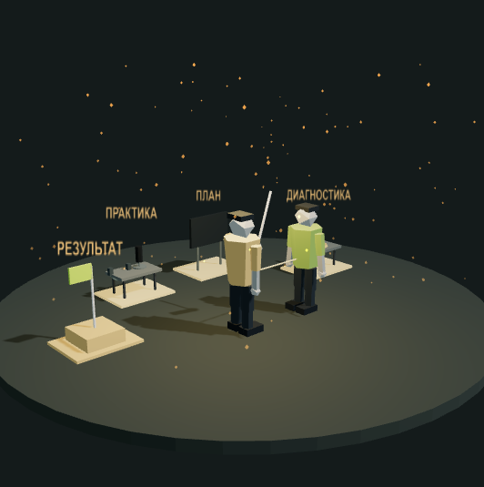

Развитие сцены: 66%.

Ученик выпрямляется. Подсвечиваются микрофон и наушники. Связь становится толще и ярче.

Меняем вращение корпуса и головы, а не только масштаб всей модели.

### Кадр 02D Появился маршрут

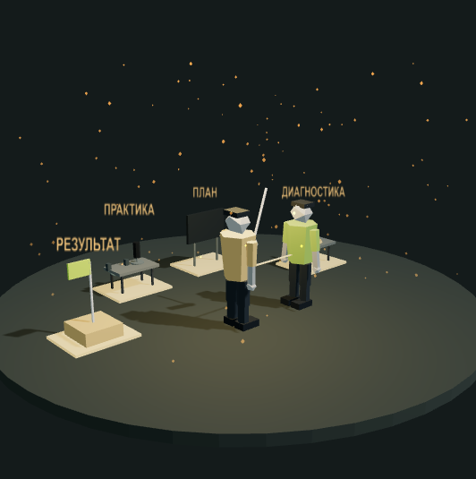

Развитие сцены: 100%.

Все четыре зоны активны. Ученик стоит прямо. На выходе светящаяся связь продолжается в восходящий путь.

Янтарный источник ещё не превращает весь кадр в яркий финал: пространство только начинает открываться.

**Переход.** Связь становится направлением движения. Тонкая светящаяся линия визуально продолжается в маршрут к следующей площадке.

## Сцена 3 Развилка троп

Раздел: Программы.

Маршрут определяется реальной задачей: IT, жизнь, бизнес или собеседование.

**Композиция и камера.** Высокий ракурс карты. Четыре направления должны помещаться в кадр и отличаться цветом и предметами, даже без чтения надписей.

**Окружение.** Бирюзовая IT-тропа #5EEAD4 с компьютером и кодом; лаймовая #C6F24E с микрофоном, чашкой и двумя людьми; янтарная #F5C77E с портфелем и графиком; оранжевая #FF6B35 с дверью, стулом и CV.

**Ученик.** Стоит в центре развилки, выпрямлен. Слегка поворачивает голову и корпус к направлениям. Цвет уже лаймовый.

**Тренер.** Стоит рядом, по очереди указывает на направления. Жест не закрывает центральную фигуру.

**Свет и атмосфера.** Каждая тропа даёт собственный цвет. В центре оттенки смешиваются. Лёгкий туман, разноцветные искры вдоль маршрутов.

### Кадр 03A Точка выбора

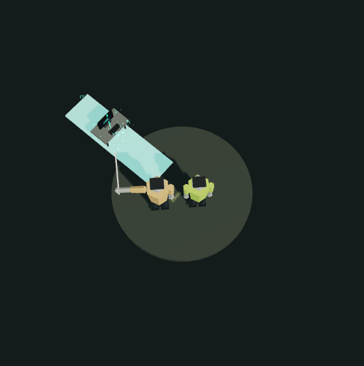

Развитие сцены: 0%.

Ученик и тренер стоят в центре. Начинает появляться первое направление. Центральная площадка остаётся неподвижной.

IT-тропа связывается с вкладкой «Для IT» в интерфейсе.

### Кадр 03B Направления открываются

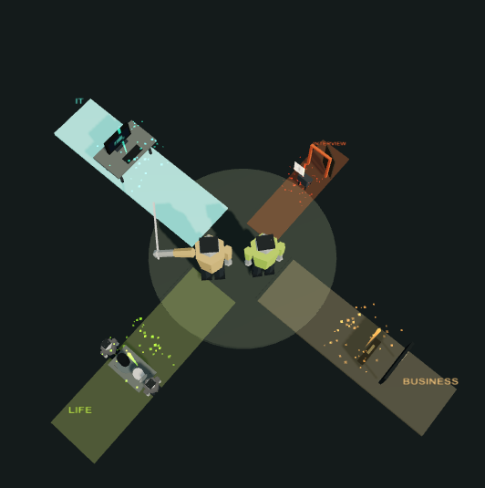

Развитие сцены: 33%.

Тропы проявляются последовательно. Объекты вдоль каждой появляются вместе с её поверхностью.

В свободном воспроизведении ориентир — задержка 300 мс. На сайте последовательность привязана к прокрутке.

### Кадр 03C Выбор задачи

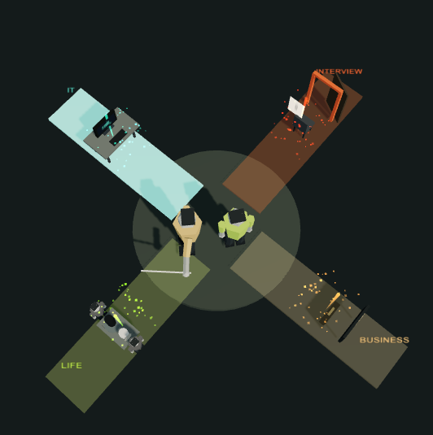

Развитие сцены: 66%.

Все четыре тропы видны. Выбранная программа светится ярче, остальные затемнены. Тренер направляет внимание жестом.

Цвета совпадают в HTML и 3D. Выбор доступен мышью, касанием и стрелками клавиатуры.

### Кадр 03D Четыре пути к одному результату

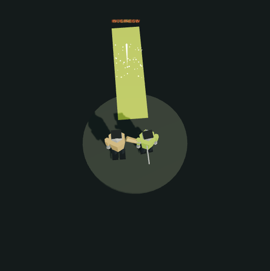

Развитие сцены: 100%.

Тропы сходятся в одно направление. Предметы программ уходят на второй план, поверхность становится общей восходящей дорогой.

Объекты не телепортируются поверх героя: их скрываем до полного слияния поверхностей.

**Переход.** Четыре направления поворачиваются к общему выходу, становятся лаймовыми и сливаются в один широкий путь.

## Сцена 4 Подъём

Раздел: Прогресс.

Практика становится уверенностью; изменение показывают поза, движение и окружение.

**Композиция и камера.** Средний план сопровождения. Камера следует за продвижением ученика и удерживает голову в верхней центральной части композиции.

**Окружение.** Широкая восходящая дорога. Каменные столбы с линиями роста. Low-poly растения с раскрывающимися листьями. Искры вдоль дороги.

**Ученик.** Уверенно идёт, спина прямая. Масштаб 0.9 → 1.3; одежда постепенно становится лаймовой. Изменение роста происходит только в этой главе.

**Тренер.** Идёт рядом и немного впереди, оставляя ученику основной визуальный вес.

**Свет и атмосфера.** Яркий тёплый янтарь смешивается с лаймом. Туман почти исчез. Золотистых и лаймовых искр больше, они ускоряются вверх.

### Кадр 04A Первый уверенный шаг

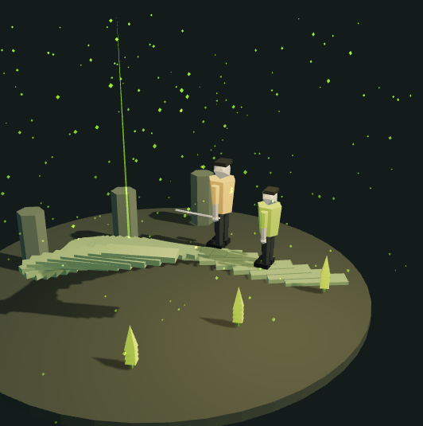

Развитие сцены: 0%.

Ученик выходит на дорогу. Тренер рядом. На столбах только начало линий роста; листья ещё собраны.

Размер ученика 0.9. Не меняем пропорции головы относительно тела.

### Кадр 04B Результат становится заметным

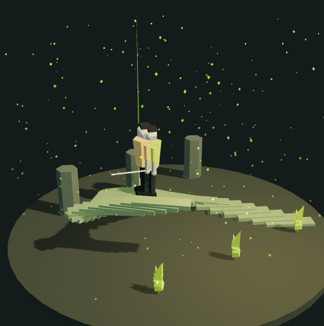

Развитие сцены: 33%.

Ученик продвигается по изгибу. Первая часть графиков прорисована, листья начинают открываться.

Камера сопровождает движение, а не оставляет героя у края кадра.

### Кадр 04C Рост через регулярность

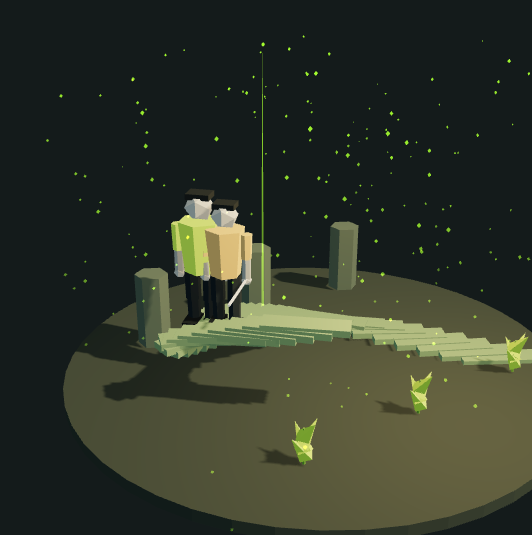

Развитие сцены: 66%.

Одежда ближе к лайму. Графики и растения развиты, искры поднимаются быстрее. Тренер чуть впереди.

Масштаб примерно 1.16. Подъём тела соответствует высоте дороги, ноги не висят над ней.

### Кадр 04D Можно увидеть разницу

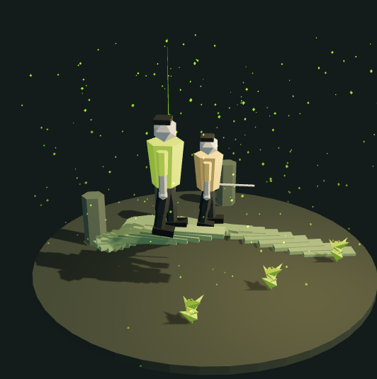

Развитие сцены: 100%.

Ученик достигает верхнего участка дороги. Графики завершены, листья раскрыты. Силуэт самый уверенный в этой главе.

Размер 1.3. Завершение кривой роста служит сигналом для перехода к общему плану.

**Переход.** Дорога поднимается к верхней части площадки. Камера отлетает, чтобы показать весь пройденный путь.

## Сцена 5 Обзор пути

Раздел: О репетиторе.

Тренер помогает пройти путь целиком; зритель видит связь начала, практики и результата.

**Композиция и камера.** Общий план всей вертикальной спирали. Камера отлетает, затем медленно обходит композицию. В кадр входят тёмное основание и светлая вершина.

**Окружение.** Все предыдущие пространства на своих высотах; светящаяся связующая линия; след из искр; отдельная боковая площадка тренера.

**Ученик.** Присутствует в символических этапах маршрута. Для обзорного кадра используется читаемое состояние каждого этапа, а не кадр после разрушения всех объектов.

**Тренер.** На боковой площадке, неподвижен, подсвечен янтарным источником. Наблюдает, не перехватывая центр истории.

**Свет и атмосфера.** Сбалансированная общая экспозиция. Дымка зависит от высоты: плотнее внизу, прозрачная наверху. Серые частицы внизу, яркие наверху.

### Кадр 05A Весь путь впервые

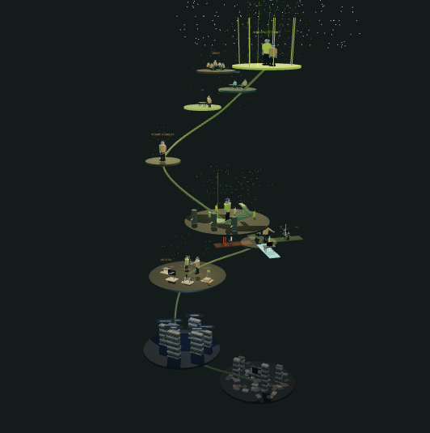

Развитие сцены: 0%.

Общий план раскрывает вертикальную структуру. Видны тёмное начало, развилка и светлая вершина.

Все сцены остаются в одном пространстве. Обзор не заменяется независимой картинкой.

### Кадр 05B Связь этапов

Развитие сцены: 33%.

Камера немного обходит спираль. Светящаяся линия соединяет площадки; искры продолжают подниматься.

Плотность дымки уменьшается по мировой координате высоты, а не равномерно по всему кадру.

### Кадр 05C Роль тренера

Развитие сцены: 66%.

Боковая площадка тренера читается в общем силуэте. Его поза неподвижна, пока камера продолжает медленный обзор.

Не добавляем жесты, спорящие с ощущением спокойствия и контроля.

### Кадр 05D От маршрута к ритму

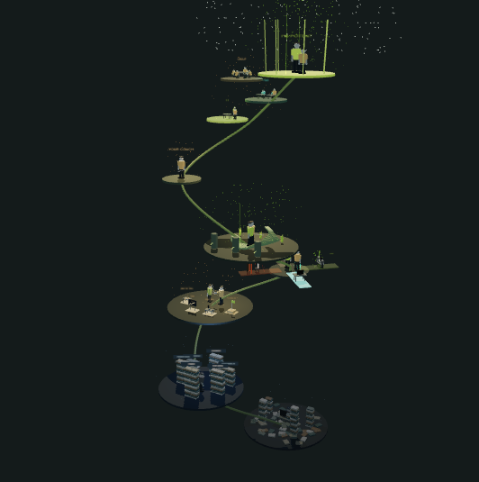

Развитие сцены: 100%.

Обзор завершён. На выходе камера направляется к площадкам тарифов.

Нижние сцены остаются тёмными: общая экспозиция не должна выжигать светлую вершину.

**Переход.** Камера опускается от общего плана к трём форматам занятий.

## Сцена 6 Уровни

Раздел: Тарифы.

Форматы различаются количеством внимания и участников, а не обещанием разного качества результата.

**Композиция и камера.** Общий ракурс трёх уровней. При выборе формат становится центром внимания, но соседние уровни остаются видны для сравнения.

**Окружение.** Индивидуально — один стол и ученик; пара — два стола и ученика; мини-группа — круглый стол и четыре ученика. Тренер на каждом уровне.

**Ученик.** Герой выделяется в выбранном формате. Сидящие участники слегка двигаются с дыханием.

**Тренер.** В индивидуальном формате рядом с учеником; в паре между учениками; в группе перемещается между участниками.

**Свет и атмосфера.** Индивидуально — лайм, пара — бирюза, группа — янтарь. Выбранная площадка светлее, соседние спокойнее. Лёгкий туман.

### Кадр 06A Индивидуальный формат

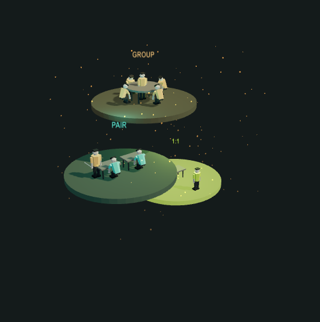

Развитие сцены: 0%.

Лаймовая площадка активна. Один ученик, один стол, тренер рядом. Остальные уровни остаются видны.

Цена в интерфейсе: 1 500 ₽ за занятие; два занятия в неделю дают пример 12 000 ₽ в месяц.

### Кадр 06B Практика в паре

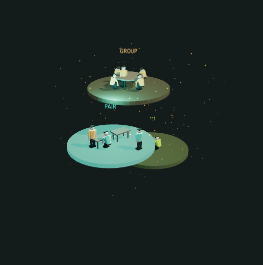

Развитие сцены: 33%.

Бирюзовая площадка становится ярче. Два ученика и два стола ясно различимы, тренер работает между ними.

Цена: 950 ₽ за занятие. Калькулятор и подсветка меняются от одного выбора.

### Кадр 06C Мини-группа

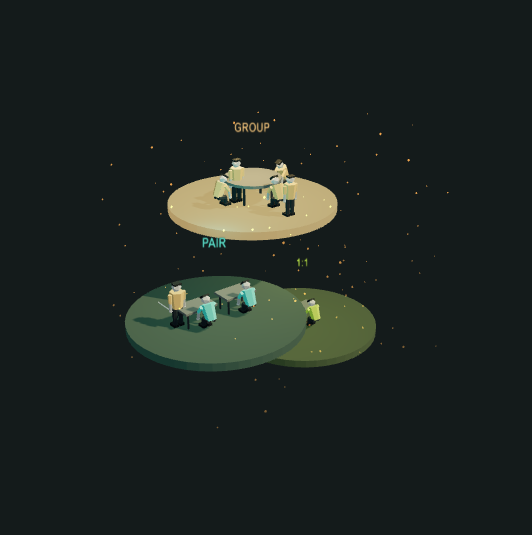

Развитие сцены: 66%.

Янтарный верхний уровень активен. Четыре ученика вокруг круглого стола; тренер перемещается рядом.

В файле указано 4–6 участников. Для этой реализации выбраны четыре, чтобы совпасть с текстом лендинга «до 4».

### Кадр 06D Свой ритм выбран

Развитие сцены: 100%.

Сравнение завершено, активный формат удерживается. На выходе камера начинает подъём к финальной площадке.

Цены переведены на обозначение ₽ без изменения числовых значений; это примеры тарифов, а не валютный пересчёт.

**Переход.** Камера поднимается к вершине. Выбранный формат сохраняется в состоянии страницы.

## Сцена 7 Вершина

Раздел: Контакты.

Финал зеркально повторяет низкий ракурс начала: теперь человек стоит уверенно и может действовать.

**Композиция и камера.** Фронтальный ракурс снизу. Ученика видно в полный рост; над ним читается I'M POTENT. В завершении камера отлетает к общему плану.

**Окружение.** Светящаяся лаймовая площадка; ученик; тренер чуть позади; парящая надпись; искры, вертикальные светящиеся линии и звёзды.

**Ученик.** Выпрямлен, уверенно стоит. Лаймовая одежда с мягким свечением. Медленно поворачивается, сохраняет масштаб 1.3.

**Тренер.** Позади. Постепенно отходит в сторону и становится прозрачным, уступая основной силуэт ученику.

**Свет и атмосфера.** Самый тёплый и яркий этап. Туман у вершины отсутствует. Свет и надпись слегка пульсируют; искры уходят вверх.

### Кадр 07A Зеркало первого кадра

Развитие сцены: 0%.

Низкая камера снова смотрит на человека. Теперь он стоит прямо на светлой вершине, а не сидит под книгами.

Сохраняем сравнимый ракурс, чтобы трансформация читалась без дополнительного текста.

### Кадр 07B Я могу говорить

Развитие сцены: 33%.

Надпись I'M POTENT парит над головой. Ученик слегка поворачивается; искры уходят за пределы кадра.

Свечение не перекрывает силуэт рук и ног. Текст остаётся читаемым и не мигает резко.

### Кадр 07C Результат принадлежит ученику

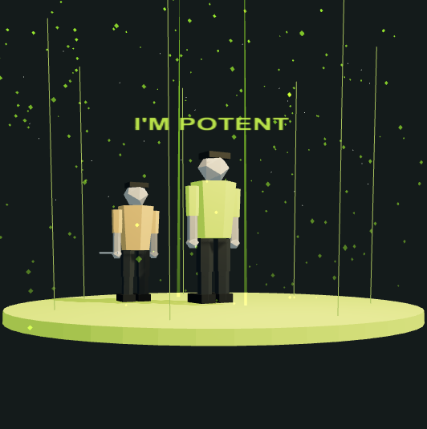

Развитие сцены: 66%.

Тренер стоит чуть позади и начинает уступать центр. Ученик остаётся самым ясным объектом.

Фигура тренера исчезает плавно. Яркость меняется на несколько процентов, без стробоскопического эффекта.

### Кадр 07D Путь завершён, история продолжается

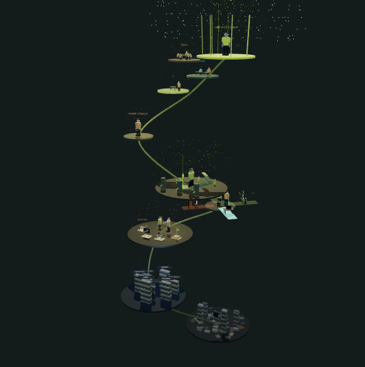

Развитие сцены: 100%.

Тренер уходит в искры. Камера отлетает и показывает всю спираль; остаётся мягкое свечение вершины.

На лендинге финальное отдаление идёт примерно за девять секунд при видимой сцене. В reduced motion используется статичный ключевой кадр.

**Переход.** Это конец истории. Камера показывает спираль целиком; яркость смягчается, форма записи остаётся доступной.

## Переходы между сценами

| Переход | Изменение окружения | Работа камеры |
|---|---|---|
| 0 → 1 | Напольные книги исчезают, раскрывается лабиринт | Подъём от низкого ракурса к виду сверху и сбоку |
| 1 → 2 | Стены рассыпаются, надписи исчезают, появляется янтарный свет | Движение к открытому пространству |
| 2 → 3 | Связующая линия продолжается в путь и четыре направления | Подъём к ракурсу карты |
| 3 → 4 | Тропы сходятся в одну дорогу, появляется окружение роста | Снижение к среднему плану сопровождения |
| 4 → 5 | Раскрывается весь путь | Отъезд к общему плану |
| 5 → 6 | Внимание переходит к трём форматам | Снижение к уровням |
| 6 → 7 | Формат остаётся выбранным, появляется вершина | Подъём к финальному ракурсу снизу |

Камера интерполируется с easeInOutCubic. Во время движения прозрачность сцены слегка снижается; CSS-переход занимает 180 мс. Затемнение привязано к прогрессу прокрутки, поэтому при остановке или движении назад экран не зависает чёрным.

## Поведение интерфейса

- Вкладки программ управляют четырьмя тропами. IT — бирюза, жизнь — лайм, бизнес — янтарь, интервью — оранжевый.
- Выбор формата одновременно меняет калькулятор и освещение его площадки. Количество занятий влияет на стоимость, а не на число персонажей.
- Цены отображаются в рублях. Числа сохранены: 1500, 950, 650 за занятие.
- FAQ удерживает сцену форматов и затемняет её, чтобы внимание оставалось на ответах.
- Форма контактов доступна независимо от того, закончилась ли финальная анимация.

## Доступность и производительность

Книги и искры используют InstancedMesh; движение искр вычисляется на GPU. Рендер ограничен примерно 30 кадрами в секунду, останавливается вне экрана и в скрытой вкладке. Шрифты и ресурсы локальные.

При prefers-reduced-motion выключены постоянное движение и пролёты камеры; показывается читаемое среднее состояние главы. При отсутствии или потере WebGL используется отдельный статичный рендер для каждой из восьми сцен. Пользователь может приостановить фоновое движение вручную.

При destroy освобождаются слушатели, наблюдатели, RAF, геометрия, материалы, CanvasTexture, InstancedMesh, тени и renderer.

## Решения по неоднозначностям исходного файла

В начале описания Hero туман рассеивается на выходе, а в таблице переходов сгущается. В реализации он остаётся плотным и холодным до лабиринта, затем заметно рассеивается на встрече с тренером.

В описании группы указано 4–6 учеников, а лендинг обещает до четырёх. В сцене группы четыре участника.

В середине файла частицы указаны как Points, в финальном техническом списке — InstancedMesh. Для искр выбрана инстансированная геометрия; звёзды используют Points.

Чистый FogExp2 равномерный, поэтому в обзорном кадре дополнительно применяется дымка, зависящая от мировой высоты. Низ остаётся тёмным, вершина — прозрачной.

Задержка появления троп 300 мс — ориентир для ролика. В лендинге этапы обратимо привязаны к прокрутке.
